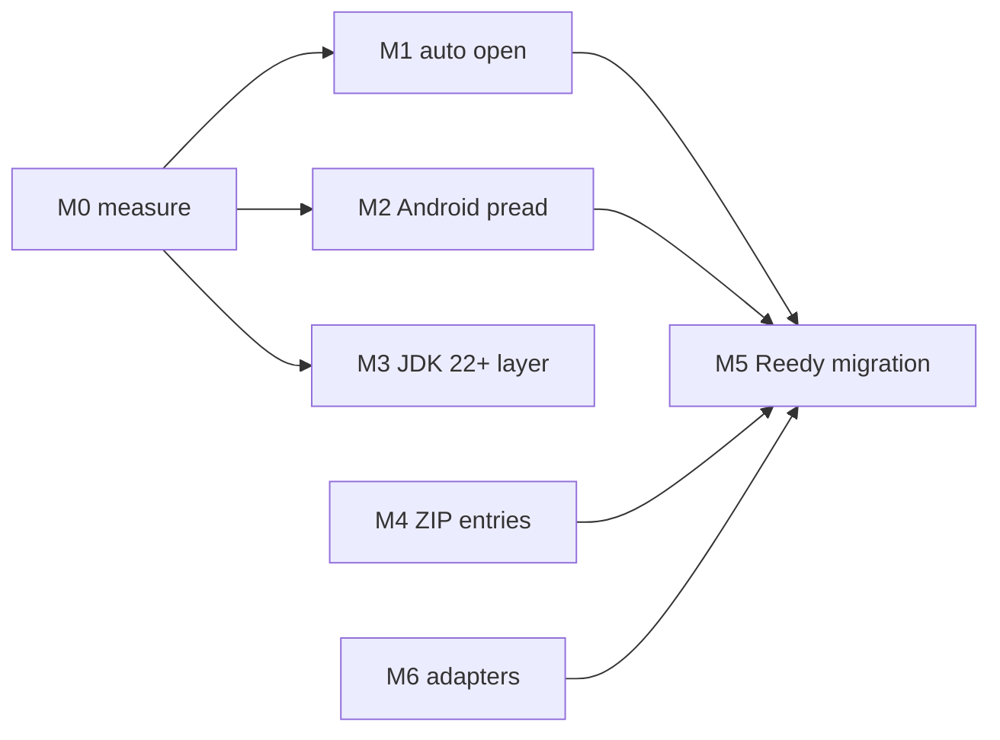

# Roadmap, ideas, and notes

### Ports to other languages

The contract in [`docs/spec/random-access-data.md`](docs/spec/random-access-data.md)
is written so that ports can pass the same case table.

* Native TypeScript/JavaScript, across runtimes (Node, Bun, Deno, browsers).
* Rust, including Rust compiled to WASM/WASI.

## Plan

Goal and rules: `AGENTS.md` "Vibe & principles". This plan ends when the Reedy
Android app deletes `azadev.io.rad`, the I/O half of `DataAccessor` and its
`ZipWrapper` plumbing, and uses this library instead.

## Milestones (in order of value per effort)

### M0. Measure first

Unpublished `:benchmarks` module: JMH through kotlinx-benchmark on the JVM and
native targets, androidx.benchmark on Android devices. Results are committed as
a table with device, OS/API level, runtime, filesystem and date, plus the
decision rule each one feeds.

Axes (each swept geometrically to its mechanism limits, never one point):

| Axis | Values |
|---|---|
| Source | every implementation, plus `Os.pread` (M2) and FFM mapping (M3) |
| Read size | 1 B … 4 MiB (page size, 16 KiB and the L2 size are the breakpoints) |
| Access pattern | random, sequential, strided, one whole-file read |
| Threads | 1 … 2× cores |
| File size vs RAM | in page cache; larger than free RAM; cold cache |
| Runtime | JDK 17/21/25; Android API 21-23, 29-30, 35+ on low- and high-end devices; Linux, macOS, Windows native |

Metrics: throughput, p50/p99 latency, allocations per read, syscalls per read,
resident memory and page-cache footprint, open cost.

Done when every M1 rule below cites a row of the table.

### M1. `open()` chooses the source

The ladder Reedy uses today, measured instead of guessed:

| File | JVM | Android |
|---|---|---|
| small (≤ T1) | read into a heap array once | same |
| medium (≤ T2, memory allows) | mmap | mmap, only if M0 safety test passes |
| large / mmap failed | positional `FileChannel` (or FFM, M3) | `Os.pread` (M2), then `FileChannel` |
| pipe, socket, compressed asset | read into memory, or pooled streams when too large | same |

* T1 and T2 come from M0; T2 depends on available memory (Reedy: memory class / 4,
  capped at 64 MiB).
* Safety gate: truncate a mapped file while another thread reads it. HotSpot
  raises `InternalError`; on ART the result is unmeasured. If ART kills the
  process, mmap is never an Android default.
* Detect the cheapest source behind any input: a `FileInputStream` or anything
  holding a `FileChannel` or descriptor opens positionally instead of being
  copied (Reedy's `fileChannel` probe).
* One `stat` per open: `open(File)` now calls `exists()` and `isFile`, two
  syscalls before the open.
* Optional `OpenOptions` (mode override, read hint) for callers who need control;
  the plain call stays zero-decision.

### M2. Android `Os.pread` source (API 21)

Positional read straight on the descriptor: no `FileChannel` position lock, and a
reader's `Thread.interrupt()` no longer closes the file for every handle (the
`FileChannel` behaviour documented in `AGENTS.md`). Size from `Os.fstat`;
`Os.sendfile` (API 28) for `transferTo` to a descriptor; `Os.lseek` probe, and a
pipe falls back to the stream path. Expected: matches or beats `FileChannel` on
every M0 Android row.

### M3. JDK 22+ layer in a multi-release jar

Classes under `META-INF/versions/22` use FFM: `FileChannel.map(…, Arena)` returns
a `MemorySegment`.

* Maps files over 2 GiB with one mapping (JDK 17-21 keep several `ByteBuffer`
  mappings of at most `Int.MAX_VALUE` each).
* Unmaps on close through `Arena`. `Unsafe.invokeCleaner` is deprecated by JEP 471
  and will be denied by default in a later JDK; after that, unmapping silently
  waits for GC.
* `madvise` hints through the FFM `Linker` (Lucene `MMapDirectory` does the same).

Must keep working in every consumer kind: Android (check that D8/R8 ignore or
accept `META-INF/versions/22`), KMP JVM, plain Java on Maven and Gradle. FFM does
not exist on Android, so Android uses M2 instead.

### M4. ZIP entries as sources

Reedy reads EPUB/FB2 ZIPs through Zip4j and a `java.util.zip` fallback. Here: a
ZIP reader over any `RandomAccessData`. A stored entry is a zero-copy `slice`; a
deflated entry inflates through pooled streams (the `StreamFactoryRad` pool). JVM
and Android use `java.util.zip.Inflater`; other targets need their own inflate, so
it is a separate module if that needs a dependency.

### M5. Reedy migration

Done when Reedy builds without `azadev.io.rad`, and its `DataAccessor` factories
reduce to `RandomAccessData.open(…)` calls. Reedy-only parts (charset
transcoding, parser sources) stay in Reedy. Reedy's field notes carry over:
`ParcelFileDescriptor` keeps the descriptor valid after its stream and channel
close, unlike the desktop JVM (`FdWrapperTest` there).

### M6. Adapters (export direction)

| Adapter | Where | Why |
|---|---|---|
| `MediaDataSource` (API 23) | core Android: SDK only, no dependency | Reedy's `RadMediaDataSource`; MediaPlayer, MediaExtractor |
| media3 `DataSource` | new module `:fluxo-io-rad-media3` | Reedy's `RadDataSource`; ExoPlayer |
| `StorageManager.openProxyFileDescriptor` (API 26) | core Android | any source as a seekable descriptor for APIs that only take one |

## Hypotheses to test (M0 settles most)

| # | Claim | Evidence so far | Overturned if |
|---|---|---|---|
| H1 | mmap beats positional reads ~1.6-3× for 1-16 KiB random reads | Reedy's `RandomAccessDataBenchmark` results (2021, one thread): Redmi 3 Pro API 21 vs `FileChannel` 1.6-1.9×, POCO X3 API 29 vs `RandomAccessFile` 2.8-2.9× | modern devices or JDKs show < 1.2× |
| H2 | a heap copy wins below some size even counting the read-in cost | ancestor: array 3-5× faster per read | the open cost exceeds savings for typical read counts |
| H3 | `Os.pread` ≥ `FileChannel` on Android | none | M0 Android rows |
| H4 | lock-free mmap reads scale with threads | lease design, unmeasured | throughput flat past 2 threads |
| H5 | `AsynchronousFileChannel` never wins | ancestor: slowest, OOM | any M0 row it wins |
| H6 | virtual threads (JDK 21+) make `asAsync` cheaper than any native async file API on the JVM | JEP 444: file I/O compensates the carrier pool | M0 async rows |
| H7 | `MADV_RANDOM` as a default hurts | Lucene 10 made RANDOM the default, 10.3 went back to NORMAL | M0 with hints |
| H8 | `transferTo` file→file is in-kernel on JDK 20+ (`copy_file_range`) | JDK-8292562 | strace in M0 |

## Candidate sources (to rank after M0; separate module when a dependency is needed)

* HTTP Range source (needs HTTP: own module): 206 vs 200 check, ETag/`If-Range`.
* Browser OPFS `FileSystemSyncAccessHandle.read(buf, {at})` (dedicated workers
  only).
* Browser `Blob` source on Wasm-JS (JS interop for `Blob.slice` and
  `arrayBuffer()` without a core dependency).
* Node async `FileHandle.read`; Bun `Bun.file().slice()`.
* Android `SharedMemory` (API 27) through the `ByteBuffer` source.
* Concatenated source over several sources.
* Native: `mmap` + `madvise`, `posix_fadvise`, `preadv`, macOS
  `F_RDADVISE`/`F_NOCACHE`, Windows file mapping and
  `FILE_FLAG_RANDOM_ACCESS`; io_uring on Linux (often blocked by seccomp).
* JVM `ExtendedOpenOption.DIRECT` for one-pass scans of huge files (aligned
  buffers only).
* Interrupt-safe JVM default: reopen by path with a file-identity check, or
  `RandomAccessFile`; decided by M0 cost.
* A memory-use report per source (Reedy tracks `usedMemory` per accessor) if the
  auto ladder holds heap copies.

### Triggered modernization

  
Show

* Build on Kotlin 2.5 once 2.5.0 is stable, not on a Beta: Native/JS/Wasm
  consumers need at least the compiler minor the klibs were built with. Kotlin
  2.5 drops `watchosArm32`; drop it and the deprecated x64 Apple targets (now
  declared explicitly in each module) together, listed under Removed.
* Migrate to Kotlin's built-in ABI validation only after fluxo-kmp-conf supports
  it for this project shape.
* Consider stdlib atomics only after `ExperimentalAtomicApi` is no longer
  required for the needed operations.
* Revisit `Java8BufferCompat` removal only as an explicit source-API decision.

